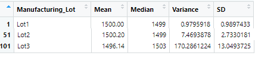
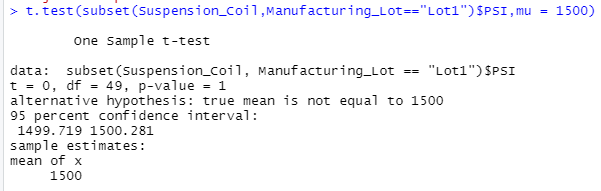

# MechaCar_Statistical_Analysis

This special project was to create analytical data that would identify variables in a dataset to help predict the mpg of MechaCar prototypes.  By taking a deep dive into the technical analysis, it provides easier determination on making key decisions about the business.

Here were the deliverables requested by the business:
1. Provide a Linear Regression model to predict the MPG
2. Provide a Summary of Statistics on Suspension Coils
3. Conduct T-Testing on Suspension Coils
4. Design a Study Comparing MechaCar with some competitors

The linear regression model was created on six variables (vehicle_length, vehicle_weight, spoiler_angle, ground_clearance, AWD, mpg).  The purpose of this model is to evaluate and predict the possible MPG of the vehicles.

## Linear Regression to Predict MPG

Which variables/coefficients provided a non-random amount of variance to the mpg values in the dataset?
Within the 50 prototype dataset of MechaCars the linear regression model against MPG dictates that the most significant variables are the Vehicle Length and the Ground Clearance as show in Figure1 (below).  The resulted p-values of 2.6x10 -12
and 5.21x10 -8.  The intercept is quite significant and may reflect that there are other factors that impact the MPGs.

### 

Is the slope of the linear model considered to be zero? Why or why not?
The slope of the linear model cannot be considered zero as the p-value is 5.35x10 -11, as depicted by Figure1.  Which indicates that the null hypothesis must be rejected.

Does this linear model predict mpg of MechaCar prototypes effectively? Why or why not?
The R-squared value of 0.7149 indicates that this model is approximately 71% accurate.  So this prediction may not be the most effective way of predicting the MPG of MechaCar prototypes.

## Summary Statistics on Suspension Coils

In this dataset the results were captured in three different produciton lots.  Per the manufacturer, the weight capacities of multiple suspension coils were tested to gauge the consistency of the manufacturing process.  The summary statistics are shown in Figure2 below.

### 

The design specifications for the MechaCar suspension coils dictate that the variance of the suspension coils must not exceed 100 pounds per square inch. Does the current manufacturing data meet this design specification for all manufacturing lots in total and each lot individually? Why or why not?

By summarizing the data, you can see that Lot 1 and Lot 2 are within design specification.  Lot 3 shows that the variance is outside of the 100PSI limit, showing 170.28.

### 

## T-Tests on Suspension Coils

### 
### 
### 
### 

In analyzing the T-Tests above, the first is a cumulative view of Lots 1, 2, 3 together, depicting that there isn't an difference in the population mean and the P-Value isn't low enough to reject the null hypothesis.  The Lot1 T-Test for the suspension coils also states that there isn't a differenc in the population mean, and with a P-Value of 1, it's also not low enough to reject the null hypothesis.  The Lot2 T-Test has revealed a P-Value of 0.6072 and also not low enough to reject the null hypothesis.

In reviewing the data in the T-Test for Lot3, however, the P-Value of 0.04168 is enough to reject the null hypothesis.  The analysis will be provided and manufacturing will need to decide how to pursue this further.

## Study Design: MechaCar vs Competition

Depending upon the demographic target of MechaCar, vying against the competition will be tough.  I say this because there have been years and years of consumer testing of the more well-known automotive brands and their loyal consumers.  Saying that, no matter what target demographic, be it sports enthusiast, soccer parent or daily commuter, most people seem to really care about one thing -- value for the money spent.

What dictates this 'value' is really what drives the market.  What's difficult is that this 'value' definition is a variable with each person you ask, and can change at a rapid pace.

Some basic key metrics to be tested should be:
1. safety - in collisions and in wear & tear
2. longevity - the life of the powertrain
3. asthetics - aerodynamics, smooth lines, appealing look/feel

With safety, measurements in MPH impact can weigh in on seatbelt safety for example.  Or airbag deployment efficiency tested on dummies with sensors.  In longevity, testing can include MTTR data on the engine and transmission.  Asthetics are important to provide a better MPG ratio on the aerodynamics as compared to others in the same automotive category.

## Summary

In conclusion, this was just a sample of the analysis that's possible given the small dataset.  Obviously the larger the dataset, the better the results.  It would be quite interesting to pursue the additional design study with some of the key elements mentioned, to determine how the MechaCar rates against some of the automotive brands that have been around for decades.  The pursuit to creating the perfect vehicle will be everlasting as technology continues grow as well as the data analysis, allowing manufacturers to become better at designing vehicles to appease the masses.